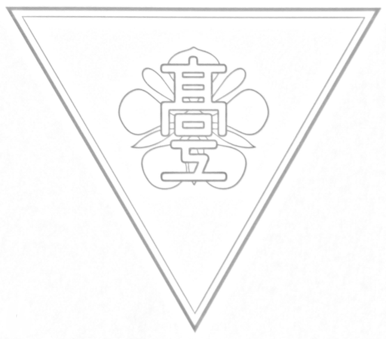
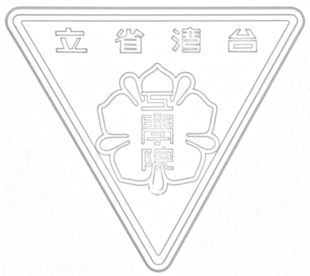
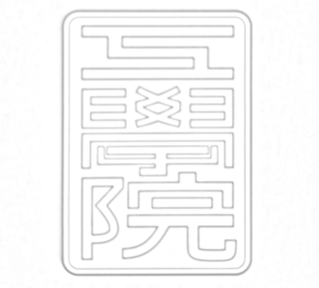
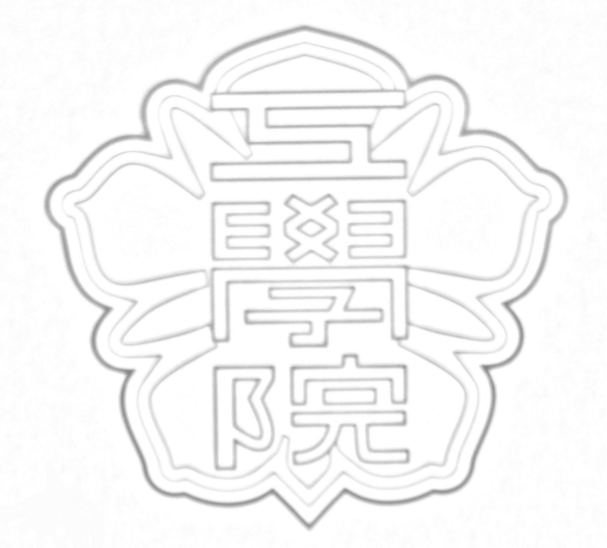
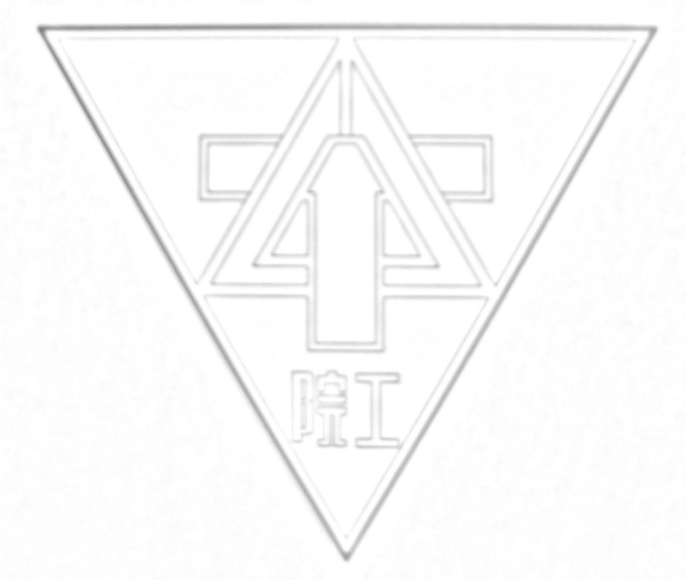
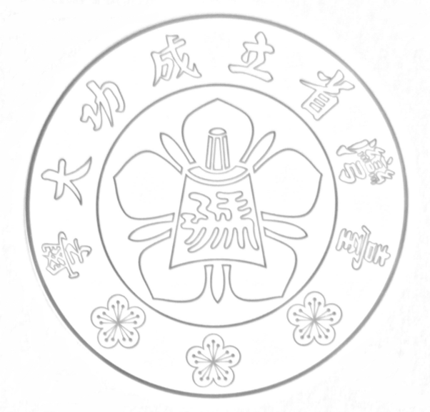
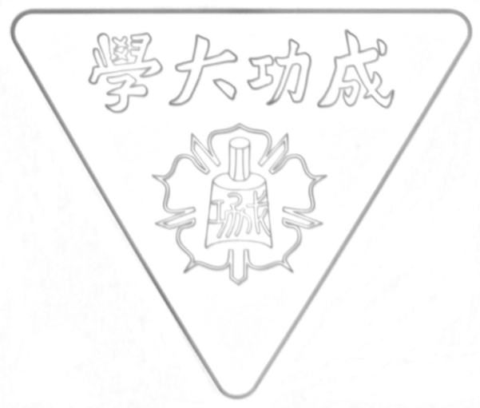
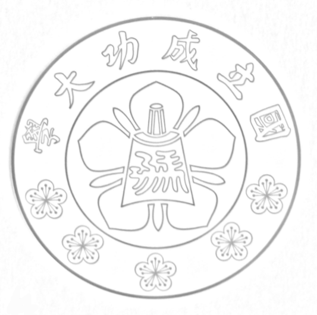
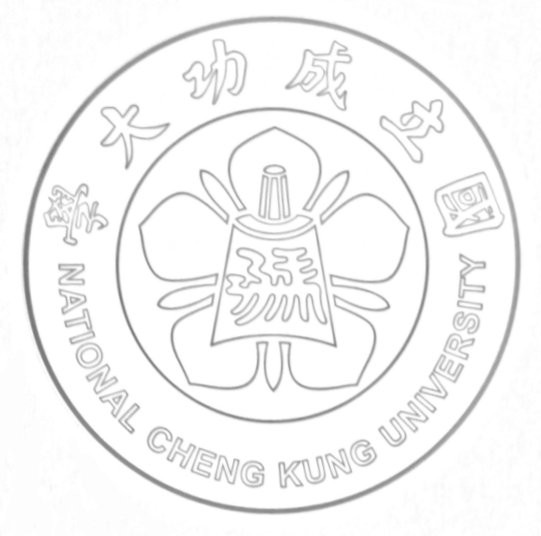
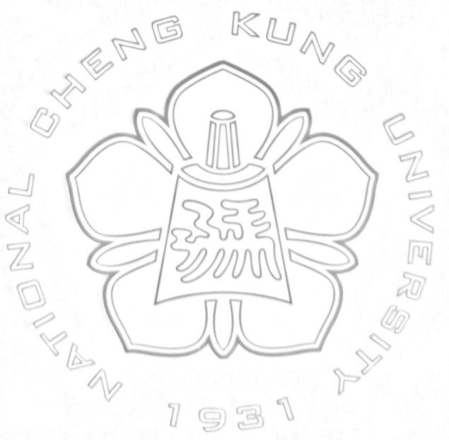

# NCKU School Badges

國立成功大學 校徽沿革

本素材掃描自 [90 周年校慶紀念資料夾](./folder.jpg)。如有違反著作權請發 Issue 告知。

更多資料可以參考[台灣總督府 台南高等工業學校的校旗](http://slyen.org/forum/viewtopic.php?t=47)。

編號   |圖片  |年代    |描述  |
|------|------|-------|------|
|1||1931-1944|臺灣總督府 臺南高等工業學校 校徽|
|2||1946-1953|臺灣省立工學院 院徽|
|3||1946-1949|臺灣省立工學院 帽徽|
|4||1949-1956|臺灣省立工學院 帽徽|
|5||1953-1956|臺灣省立工學院 院徽|
|6||1956-1985|臺灣省立 成功大學 校徽|
|7||1956-1972|臺灣省立 成功大學 胸章|
|8||1985-2011|國立 成功大學 校徽|
|9||2011-現在|國立 成功大學 校徽|
|10||2011-現在|國立 成功大學 校徽|